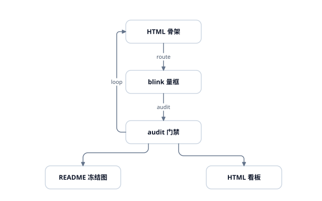

# svg-infovis · diagramming 几何内核



*上图由本仓自己生成, 就是仓里这份 `assets/hero.svg`: `bun run examples/start/full-chain.ts` 的产物(showcase 档门禁)。
`test/hero-svg.test.ts` 断言它与该示例的当前导出**逐字节一致** —— 内核改了字节而这张图没重出, 测试当场红(重生命令见该测试文件头)。*

## 装到你的项目里

```bash
npm i svg-infovis        # 或 bun add svg-infovis / pnpm add svg-infovis
```

```ts
import { nodeFit } from 'svg-infovis/knives/fit';   // 子路径即 API, 清单见下面「API 索引」
import { exportScene } from 'svg-infovis';          // 也可从 barrel 引(纯函数侧)
```

- **ESM-only**(不发 CJS), `engines: node >= 20.16`(源指纹那档走 `process.getBuiltinModule`, 20.16 起回移可用)。
- 消费者 tsconfig 的 `moduleResolution` 用 `bundler` 或 `nodenext` 都行; **老式的 `node`(node10 档)不支持**。`bun` / `vite` / `esbuild` 消费零配置可用(实测)。
- 图标素材 `lucide-static` 是 **optional dependency**: 不装也能用库本体与 barrel, 只有 `svg-infovis/icons/lucide` 与 `svginfo icons` 需要它。
- **浏览器侧算源指纹(`decisionDigest`)暂不支持** —— 那一步要 sha256, 走 bun 或 node 内置, 浏览器里没有。
- CLI: `npx svginfo --help`。有 bun 就用 bun 跑你的 `.ts` 场景文件; 没有 bun 走 node ≥22.6 的类型剥离。
- 仓内开发(改内核 / 跑示例)是另一条路 —— 见下面「30 秒起手」, 那套 `bun run examples/...` 命令都是**本仓内**用法, 装包消费用不到。

## 30 秒起手(仓内开发)

```bash
git clone https://github.com/watert/svg-infovis.git && cd svg-infovis
bun install        # 装 devDependencies + optional 的 lucide-static(图标素材)
bun run examples/start/basic.ts > /tmp/basic.svg      # descriptor 层最小路径
bun run examples/start/full-chain.ts > /tmp/chain.svg  # scene → route → audit → export 全链
./scripts/svg2png.sh /tmp/chain.svg                    # 可选: 本地栅格化(rsvg / qlmanage, 毫秒级)
```

常用入口:

- `bun run examples/manifest.ts` —— 全部示例清单(键名 / 桶 / 这张图证明什么)
- `bun run scripts/inspect.ts <scene.ts>` —— 布局读数板, 不出图; 退出码 0 通过 / 1 门禁不过 / 2 用法错
- `bun run scripts/svg-varflatten.ts <in.svg> [out.svg]` —— 外来 SVG 的 CSS 变量展平(rsvg 那一档的前置, 见文末「栅格化」)
- `svginfo run <scene.ts> -o out.svg` —— CLI 入口(`run` / `inspect` / `render` / `new` / `icons`); `bun link` 后全局可用, 装了包则 `npx svginfo`
- `bun run verify` —— `bun run build` + `bun test` + `tsc --noEmit`(改完源码跑这个; **只跑 `bun test` 不算**)

三条口吻贯穿全部文档: **零运行时依赖 · 字节确定性 · 一处事实一处**。

- 库本体与 barrel **不引任何第三方包**(这就是三条口吻里的"零运行时依赖"); 唯一的第三方依赖 `lucide-static`(图标素材)声明为 **optional dependency**, 且只在 `./icons/lucide` 与 CLI 的 `icons` 档被读到
- 禁 `Date.now` / `Math.random`, 同输入 → 逐字节相同输出 —— 于是回归对账是 SVG **文本** diff(比 PNG 像素准), 仓库里也不再囤图片快照
- 每个数字只有一个权威出处, 文档不互相抄一份

## 它是什么 / 不是什么

- **是**: 把"几何"从"渲染"里拆出来的那一层 —— 盒宽反算、正交折点、几何谓词、门禁审计、descriptor → 字节确定的 SVG。
- **不是**: data visualization 库(不绑比例尺 / 数据), 不是 layout 引擎(排布是作者的决策, core 不猜意图), 不是渲染器(产物是自包含 SVG)。

## 与 lucide-static 的关系

- 图标素材来自 npm 依赖 [`lucide-static`](https://www.npmjs.com/package/lucide-static)(ISC 许可), 声明为 **optional dependency**: 不装它也能用库本体与 barrel, 只有 `svg-infovis/icons/lucide` 与 `svginfo icons` 需要它。
- 读法是 **lazy 单图标读盘**(`require.resolve('lucide-static/icons/<name>.svg')`), 不 vendoring SVG 进仓, 也不走 barrel 全量 eager load。
- 按概念找名走 `findIcon('airplane')` —— 读包内 `tags.json`(name → tags, 含同义词)。
- 解析器 `parseIconSvg` 只认七种几何原语、零 `<g>` / 零 `transform`, 见到即抛(静默跳过 = 画出少几笔的图标)。
- 升级走 lockfile + PR, 保字节确定。
- 另有 echarts 底板四张在 `assets/embeds/`(Apache 2.0, 全文与来源说明见 [`assets/embeds/LICENSE-APACHE-2`](./assets/embeds/LICENSE-APACHE-2))。

## API 索引(按 `package.json` `exports` 子路径分组)

全部子路径从包名引(`import { nodeFit } from 'svg-infovis/knives/fit'`); 仓内开发也可相对路径引 `./src/...`。签名细节与判据以源码为单一来源, 本表只做"什么在哪个子路径"的地图。

### 总入口

- `.` —— barrel 聚合出口(纯函数侧; `node:fs` 读盘的图标模块刻意不在内)

### `geometry/` — 纯函数几何(构建期算坐标, 无副作用 / 不 mutate)

- `./geometry/vec` — 向量 / 矩形原语(`mid` = 两点中点), `round1` / `fmt` / `codepointSort`
- `./geometry/rounded-path` — 圆角路径逐角解算 + 端点标记 / 线端内缩
- `./geometry/predicates` — 几何谓词(相交 / 净空 / 正交 / 自重叠 / 有限性守卫)
- `./geometry/text-rows` — 多行文本行块堆法(度量与渲染共用)
- `./geometry/inline-text` — 行内标记解析(`**粗**` / `*斜*` / `~~删~~` / `[字]{accent}`; 度量与渲染同一份 run 表 + 一张 `INLINE_STYLE`)
- `./geometry/port` — 面的朝外法线与面上的点(`Side` / `sideDir` / `portPoint` / `PortRef`)。`knives/route` 再导出同一绑定
- `./geometry/box` — 面上的点 / 九点锚 / `bounds` / `placeRect`(面上点复用 `geometry/port` 的 `portPoint`)
- `./geometry/grid` — 均匀格子(格位 / 格心 / 格面 / 缝中线)
- `./geometry/pack` — 行 / 列摆放(`packRow` / `packCol`; 主轴间距 `gap`(缝, 单值或**逐项**数组)与 `pitch`(节距)二选一)
- `./geometry/place` — 锚点糖面(`rightOf` / `leftOf` / `below` / `above` / `centeredOn`: 把盒摆到另一个盒的某侧)

### descriptor 与序列化

- `./descriptor` — 纯数据描述符(`path/circle/rect/text/group/svg/pattern/embed` 构造器; **动效**:
  `animate()` 吐 SMIL `<animate>` / `<animateTransform>`、`style()` 吐内嵌样式表, 缓动词表
  `EASING_SPLINES` 全仓唯一 —— 名字写错当场抛, 见 `docs/animation-roadmap.md`)
- `./serialize` — descriptor → SVG 字符串(唯一字符串出口, 属性键 codepoint 序)

### `shapes/` — props → descriptor

- `./shapes/node` — 三形态节点(`rect` / `diamond` / `cylinder`)
- `./shapes/edge` — 边装配 + `edgeLabel` / `labelBoxSize`(标签遮罩尺寸唯一来源)
- `./shapes/group` — 分组框 + 标签定位
- `./shapes/text` — 文本 / 标签遮罩几何
- `./shapes/inline` — 行内标记的**唯一上屏器**(行内容串 → `<text>` ± `<tspan>`; 节点标签 / 边标签 / 旁注三家共用)
- `./shapes/grid-pattern` — 画布网格底纹(`line` / `dot`)
- `./shapes/icon` — 图标槽几何(`iconInkRect` 等)
- `./shapes/embed` — 整幅外来 SVG 的嵌套 `<svg>` 渲染
- `./shapes/stat` — 大数字块(数字 + 标签 ± delta; 盒由 `statFit` 反算, delta 标记是几何不是字形)
- `./shapes/badge` — 徽章与列表行(`badgeFit` / `listRowFit`; `{ shape, bounds }` 契约的先例)
- `./shapes/heading` — 标题梯级与分隔线(kicker / 标题 / 副标题三档 + `dividerShape`)

### `blocks/` — 带数值语义的组合块(独立子路径, **不进 barrel**)

判据是"几何里有没有一个比例 / 计数": 只收"一个数值 → 一段几何"的组件, 契约 `{ shape, bounds }`
(块能被 `pack` / `place` 当盒摆)。版式纪律与动笔前的四问见 [`blocks/README.md`](./blocks/README.md)。

- `./blocks/progress` — 单值进度条 / 100% 堆叠条(`ratio` 由作者算好, kernel 不归一化)
- `./blocks/pictogram` — 图标阵列(`k / N` 的 ISOTYPE 排布)

### `knives/` — 构建期推导与判决

- `./knives/route` — 正交路由(端口 → 折点列; `via` 是作者声明, 不是避障)
- `./knives/route-pair` — 成对双线 + 沿线标签
- `./knives/route-cost` — 候选折点列代价向量(读数, 不是门禁)
- `./knives/lanes` — 共享走廊的腰线批量分配(旋钮, 不是门禁)
- `./knives/constraints` — 一维约束账本 + 最长路("从 a 到 b 至少 N" → 位置列, 带归因)
- `./knives/thresholds` — 门禁与排序共用的尺子(`AuditLevel` / `THRESHOLDS` / `PIERCE_MIN` / `STUB_MIN`)。`knives/audit` 再导出同一绑定
- `./knives/audit` — 门禁审计(十九项 + 两档阈值) → `{ pass, metrics, diagnostics }`
- `./knives/measure` — 无浏览器文本估宽
- `./knives/fit` — `nodeFit` / `cardFit` / `textFit` 盒反算(与 `label_fit` 同源)
- `./knives/codes` — 诊断码注册表(单一来源)
- `./knives/density` — 密度 / 长边 / 混组层警示(全 warning, 不 fail-closed)
- `./knives/describe` — 场景读数板(几何 × 判决 join, 不新增判据)
- `./knives/nudge` — 对齐 / 等距 / 吸附(只动坐标, 不动拓扑)
- `./knives/cluster` — 组语义: membership 声明制 + 自洽四条门禁

### `icons/` 与 `embed/`

- `./icons/svg-parse` — 窄解析器(七原语, 零 transform)
- `./icons/path-data` — `path` 的 `d` 逐坐标改写(contain 缩放)
- `./icons/lucide` — 图标素材读盘(node 侧, 刻意不进 barrel; 数据来自 `lucide-static`)
- `./embed/svg-asset` — 整幅 SVG → 素材(fail-closed 消毒 + id 命名空间化)

### 核心出口

- `./scene` — scene 构造 / 组框派生 / 缓存新鲜度(源指纹优先, 计数兜底)
- `./export` — `tryExport`(迭代回路, 永不抛) / `exportScene`(fail-closed 交付) / `sceneChildren`(渲染面 = 审计面)
- `./theme` — 7 tone × light / dark / paper × outline / tint / solid
- `./guard` — shape 入参守卫(`ShapeInputError` / `resolveKnobs`, 把 NaN 拦在源头)
- `./runtime` — `isMainModule(import.meta.url)`: 可移植的"这个模块是入口吗"判定(bun 的 `import.meta.main` 在 node 下是 `undefined`)

模板层(`templates/{sequence,layered,lifecycle}.ts`)不在 `exports` 里 —— 仓内按路径引入, 边界宪章与字段表见 [`templates/README.md`](./templates/README.md)。

## 文档地图(一处事实一处)

> ⚠ **npm 页面 vs 仓库里**: 发布的包只带 `dist/` · `src/` · `blocks/` · `scripts/` · `templates/` · `assets/` 与 `README.md` / `LICENSE` / `QUICKREF.md` / `SKILL.md`(`files` 白名单); `refs/` · `docs/` · `examples/` · `website/` **与 `ROADMAP.md`** 都不进包 —— 下面指向这些文件的相对链接只在**仓库里**有效, 在 npm 页面读就换 [GitHub 仓库](https://github.com/watert/svg-infovis) 看同一份。

- [`QUICKREF.md`](./QUICKREF.md) —— **画图只读这一页**: 起手代码 / 缺省值表 / 误用 / 动手前七问
- [`SKILL.md`](./SKILL.md) —— 何时用 / 怎么用(coding agent 视角)与改内核的纪律
- [`refs/layering.md`](./refs/layering.md) —— **现行分层契约与边界规则**: 七层 / 依赖方向 / 准入门槛 / 三条边界轴(配图 [`architecture-v3.svg`](./refs/architecture-v3.svg), core 自画自审)
- [`refs/principles.md`](./refs/principles.md) —— 设计意图与第一性原则: 每条断言、它的代价、逼它出来的实跑事故、冲突时怎么裁
- [`refs/public-api.md`](./refs/public-api.md) —— 公共承诺面: exports 子路径即 API、变更分级、破坏性改动四步、诊断码兼容面
- [`refs/recipes.md`](./refs/recipes.md) —— 十三条图型与风格配方
- [`refs/architecture.md`](./refs/architecture.md) —— v0.1 产品管线五层的**演进史存档**(决策层 / blink 已废弃; 别拿它回答现状问题)
- [`refs/aesthetics.md`](./refs/aesthetics.md) —— 美学评估研究草案(全警示级, 不是操作手册)
- [`docs/theme.md`](./docs/theme.md) · [`docs/mermaid-geometry.md`](./docs/mermaid-geometry.md) · [`docs/blink-archive.md`](./docs/blink-archive.md) · [`docs/infograph-roadmap.md`](./docs/infograph-roadmap.md) · [`docs/avatar-lab-parity.md`](./docs/avatar-lab-parity.md)(外部对账: 解析式 3D 剪影渲染器)
- [`examples/README.md`](./examples/README.md) —— 五桶示例与出口纪律
- [`ROADMAP.md`](./ROADMAP.md) —— 立项依据与后续方向

## 运行与验证

```bash
bun run build       # tsc -p tsconfig.build.json → dist/(派生产物, gitignored)
bun test            # 纯函数单测(零依赖直跑)
bun run verify      # 上面两步 + tsc --noEmit —— 改完源码跑这个
```

栅格化走 `scripts/svg2png.sh`(优先 `rsvg-convert`, 否则 macOS `qlmanage`), 毫秒级零浏览器。

⚠ **外来 SVG 另有一坑**: 若它整张图靠 CSS 自定义属性(`var(--x)`)上色 —— archify 的 viewer 导出就是 —— rsvg / qlmanage 会把填充描边一并丢掉, 渲成"深底黑块"而**不报错**。先展平再栅格化:

```bash
bun run scripts/svg-varflatten.ts in.svg flat.svg    # 默认取深色档, --theme light 换档
./scripts/svg2png.sh flat.svg out.png 1200
```

本仓自产的图属性内联、没有变量, 不走这一步。

⚠ 出图命令**别加 `2>&1`**: 图走 stdout、诊断走 stderr, 合并会把诊断写进 SVG 文件头部, 而文件照样以 `</svg>` 收尾、退出码照样 0 —— 失败长得像成功。`svg2png.sh` 自带产物守卫会拦这种脏文件。

## License

MIT(见 [LICENSE](./LICENSE))。图标素材 `lucide-static` 为 ISC; `assets/embeds/` 底板为 Apache 2.0。
