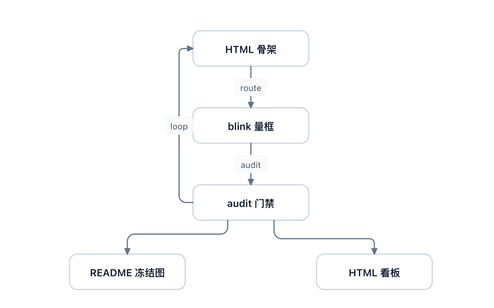

# svg-infovis · diagramming 几何内核



*上图由本仓自己生成: `bun run examples/start/full-chain.ts` 的产物(showcase 档门禁)。*

## 30 秒起手

```bash
git clone https://github.com/watert/svg-infovis.git && cd svg-infovis
bun install        # 拉 lucide-static(图标素材); 库本体零运行时依赖
bun run examples/start/basic.ts > /tmp/basic.svg      # descriptor 层最小路径
bun run examples/start/full-chain.ts > /tmp/chain.svg  # scene → route → audit → export 全链
./scripts/svg2png.sh /tmp/chain.svg                    # 可选: 本地栅格化(rsvg / qlmanage, 毫秒级)
```

常用入口:

- `bun run examples/manifest.ts` —— 全部示例清单(键名 / 桶 / 这张图证明什么)
- `bun run scripts/inspect.ts <scene.ts>` —— 布局读数板, 不出图; 退出码 0 通过 / 1 门禁不过 / 2 用法错
- `svginfo run <scene.ts> -o out.svg` —— CLI 入口(`run` / `inspect` / `render` / `new` / `icons`), `bun link` 后全局可用
- `bun run verify` —— `bun test` + `tsc --noEmit`

三条口吻贯穿全部文档: **零运行时依赖 · 字节确定性 · 一处事实一处**。

- 库本体 0 dependency; 图标素材 `lucide-static` 是构建期读盘, 不进运行时链
- 禁 `Date.now` / `Math.random`, 同输入 → 逐字节相同输出, `examples/images/*` 可做肉眼对账
- 每个数字只有一个权威出处, 文档不互相抄一份

## 它是什么 / 不是什么

- **是**: 把"几何"从"渲染"里拆出来的那一层 —— 盒宽反算、正交折点、几何谓词、门禁审计、descriptor → 字节确定的 SVG。
- **不是**: data visualization 库(不绑比例尺 / 数据), 不是 layout 引擎(排布是作者的决策, core 不猜意图), 不是渲染器(产物是自包含 SVG)。

## 与 lucide-static 的关系

- 图标素材来自 npm 依赖 [`lucide-static`](https://www.npmjs.com/package/lucide-static)(ISC 许可): **lazy 单图标读盘**(`require.resolve('lucide-static/icons/<name>.svg')`), 不 vendoring SVG 进仓, 也不走 barrel 全量 eager load。
- 按概念找名走 `findIcon('airplane')` —— 读包内 `tags.json`(name → tags, 含同义词)。
- 解析器 `parseIconSvg` 只认七种几何原语、零 `<g>` / 零 `transform`, 见到即抛(静默跳过 = 画出少几笔的图标)。
- 升级走 lockfile + PR, 保字节确定。
- 另有 echarts 底板四张在 `assets/embeds/`(Apache 2.0, 全文与来源说明见 [`assets/embeds/LICENSE-APACHE-2`](./assets/embeds/LICENSE-APACHE-2))。

## API 索引(按 `package.json` `exports` 子路径分组)

全部子路径从包名引(`import { nodeFit } from 'svg-infovis/knives/fit'`); 仓内开发也可相对路径引 `./src/...`。签名细节与判据以源码为单一来源, 本表只做"什么在哪个子路径"的地图。

### 总入口

- `.` —— barrel 聚合出口(纯函数侧; `node:fs` 读盘的图标模块刻意不在内)

### `geometry/` — 纯数学, 零依赖

- `./geometry/vec` — 向量 / 矩形原语, `round1` / `fmt` / `codepointSort`
- `./geometry/rounded-path` — 圆角路径逐角解算 + 端点标记 / 线端内缩
- `./geometry/predicates` — 几何谓词(相交 / 净空 / 正交 / 自重叠 / 有限性守卫)
- `./geometry/text-rows` — 多行文本行块堆法(度量与渲染共用)
- `./geometry/inline-text` — 行内 `**粗**` 标记解析(度量与渲染同一份)
- `./geometry/box` — 面上的点 / 九点锚 / `bounds` / `placeRect`
- `./geometry/grid` — 均匀格子(格位 / 格心 / 格面 / 缝中线)
- `./geometry/pack` — 行 / 列摆放(`packRow` / `packCol`)

### descriptor 与序列化

- `./descriptor` — 纯数据描述符(`path/circle/rect/text/group/svg/pattern/embed` 构造器)
- `./serialize` — descriptor → SVG 字符串(唯一字符串出口, 属性键 codepoint 序)

### `shapes/` — props → descriptor

- `./shapes/node` — 三形态节点(`rect` / `diamond` / `cylinder`)
- `./shapes/edge` — 边装配 + `edgeLabel` / `labelBoxSize`(标签遮罩尺寸唯一来源)
- `./shapes/group` — 分组框 + 标签定位
- `./shapes/text` — 文本 / 标签遮罩几何
- `./shapes/grid-pattern` — 画布网格底纹(`line` / `dot`)
- `./shapes/icon` — 图标槽几何(`iconInkRect` 等)
- `./shapes/embed` — 整幅外来 SVG 的嵌套 `<svg>` 渲染

### `knives/` — 构建期推导与判决

- `./knives/route` — 正交路由(端口 → 折点列; `via` 是作者声明, 不是避障)
- `./knives/route-pair` — 成对双线 + 沿线标签
- `./knives/route-cost` — 候选折点列代价向量(读数, 不是门禁)
- `./knives/lanes` — 共享走廊的腰线批量分配(旋钮, 不是门禁)
- `./knives/constraints` — 一维约束账本 + 最长路("从 a 到 b 至少 N" → 位置列, 带归因)
- `./knives/audit` — 门禁审计(十九项 + 两档阈值) → `{ pass, metrics, diagnostics }`
- `./knives/measure` — 无浏览器文本估宽
- `./knives/fit` — `nodeFit` / `cardFit` / `textFit` 盒反算(与 `label_fit` 同源)
- `./knives/codes` — 诊断码注册表(单一来源)
- `./knives/density` — 密度 / 长边 / 混组层警示(全 warning, 不 fail-closed)
- `./knives/describe` — 场景读数板(几何 × 判决 join, 不新增判据)
- `./knives/nudge` — 对齐 / 等距 / 吸附(只动坐标, 不动拓扑)
- `./knives/cluster` — 组语义: membership 声明制 + 自洽四条门禁

### `icons/` 与 `embed/`

- `./icons/svg-parse` — 窄解析器(七原语, 零 transform)
- `./icons/path-data` — `path` 的 `d` 逐坐标改写(contain 缩放)
- `./icons/lucide` — 图标素材读盘(node 侧, 刻意不进 barrel; 数据来自 `lucide-static`)
- `./embed/svg-asset` — 整幅 SVG → 素材(fail-closed 消毒 + id 命名空间化)

### 核心出口

- `./scene` — scene 构造 / 组框派生 / 缓存新鲜度(源指纹优先, 计数兜底)
- `./export` — `tryExport`(迭代回路, 永不抛) / `exportScene`(fail-closed 交付) / `sceneChildren`(渲染面 = 审计面)
- `./theme` — 7 tone × light / dark / paper × outline / tint / solid
- `./guard` — shape 入参守卫(`ShapeInputError` / `resolveKnobs`, 把 NaN 拦在源头)

模板层(`templates/{sequence,layered,lifecycle}.ts`)不在 `exports` 里 —— 仓内按路径引入, 边界宪章与字段表见 [`templates/README.md`](./templates/README.md)。

## 文档地图(一处事实一处)

- [`QUICKREF.md`](./QUICKREF.md) —— **画图只读这一页**: 起手代码 / 缺省值表 / 误用 / 动手前七问
- [`SKILL.md`](./SKILL.md) —— 何时用 / 怎么用(coding agent 视角)与改内核的纪律
- [`refs/recipes.md`](./refs/recipes.md) —— 十三条图型与风格配方
- [`refs/architecture.md`](./refs/architecture.md) —— 分层契约与当前实现边界
- [`refs/aesthetics.md`](./refs/aesthetics.md) —— 美学评估研究草案(全警示级, 不是操作手册)
- [`docs/theme.md`](./docs/theme.md) · [`docs/mermaid-geometry.md`](./docs/mermaid-geometry.md) · [`docs/blink-archive.md`](./docs/blink-archive.md)
- [`examples/README.md`](./examples/README.md) —— 五桶示例与出口纪律
- [`ROADMAP.md`](./ROADMAP.md) —— 立项依据与后续方向

## 运行与验证

```bash
bun test            # 纯函数单测(零依赖直跑)
bunx tsc --noEmit   # 类型检查
bun run verify      # 两者一起
```

栅格化走 `scripts/svg2png.sh`(优先 `rsvg-convert`, 否则 macOS `qlmanage`), 毫秒级零浏览器。

⚠ 出图命令**别加 `2>&1`**: 图走 stdout、诊断走 stderr, 合并会把诊断写进 SVG 文件头部, 而文件照样以 `</svg>` 收尾、退出码照样 0 —— 失败长得像成功。`svg2png.sh` 自带产物守卫会拦这种脏文件。

## License

MIT(见 [LICENSE](./LICENSE))。图标素材 `lucide-static` 为 ISC; `assets/embeds/` 底板为 Apache 2.0。
