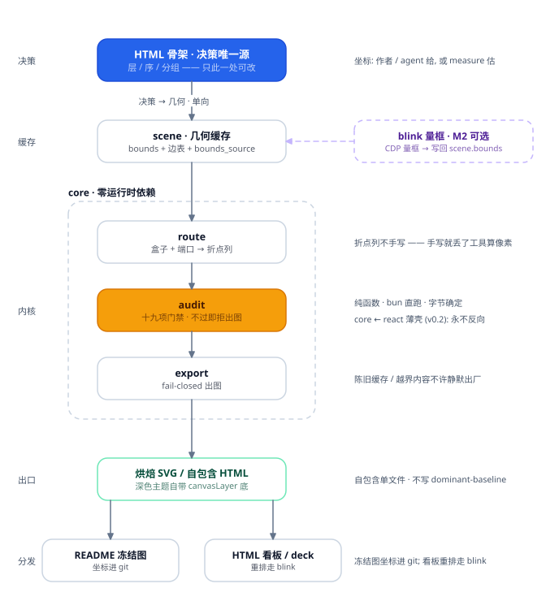
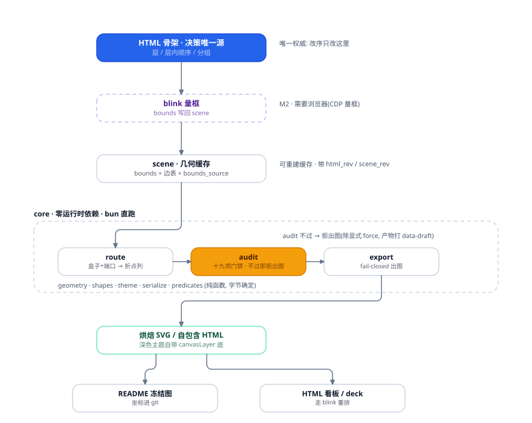

# svg-infovis 架构（v1/v2 产品管线 · **演进史存档**）

> ⚠ **本篇是演进史, 不是现状契约**。它讲的是 v0.1 的**产品管线五层**(决策 / 缓存 / 内核 / 出口 /
> 分发), 其中**决策层(HTML 骨架)与 blink 旁路均已废弃**, 只留下论证价值。
> 现行**模块分层**(七层职责 / 依赖方向 / 准入门槛 / 三条边界轴)看
> [`layering.md`](./layering.md), 配图 [`architecture-v3.svg`](./architecture-v3.svg)。
>
> 两篇的分层不是一回事: 本篇分的是**一次出图经过几道工序**, layering 分的是**代码按什么职责摆**。
> 缺 `blocks/` 与 `templates/` 的正是本篇 —— 所以别拿它回答"某件东西该放哪层"。

> 这张图**本身是 core 画的, 而且在出图之前先过一遍 `showcase` 级 audit**（不过即 `exit 1`）:
> 重跑 `bun run refs/build-arch-v2.ts > refs/architecture-v2.svg`。
> **v1 存档**（横排 core 版, v2 之前）：`refs/build-arch.ts` → `refs/architecture.svg`

## 五层 + 一条旁路

- **决策** —— HTML 骨架：层 / 层内顺序 / 分组。**唯一权威在这里**（活在 DOM 的父子关系与 class 里）
- **缓存** —— scene：`bounds` + 边表 + `bounds_source`。可重建，**不许持有决策**
- **内核** —— core：`route` → `audit` → `export`。纯函数、零运行时依赖、bun 直跑
- **出口** —— 烘焙 SVG / 自包含 HTML。audit 不过即**拒出图**（fail-closed）
- **分发** —— README 冻结图（坐标进 git）/ HTML 看板
- **旁路 · blink 量框** —— 图上仍画着这条旁路, 但路线已**废弃**, 论证在 `docs/blink-archive.md`。不在场时 core 照跑 (走 `measure` 估宽, 产物打 `bounds_source: estimate`)

图上**只有两处实色**（solid）：**决策唯一源**（蓝）与**门禁**（琥珀）—— 其余全是描边。
即：默认 light + outline；`solid` 是用来"表达强调"的，不是默认样式。

## 三条单向依赖

- `core ← react 薄壳 ← playground`（v0.2）—— core 永不引 React / vite
- `core ← blink` —— **已废弃** (见 `docs/blink-archive.md`)。图上留着, 是为了记住它不在主链上, 不是还要做
- 决策 → 几何，不许反向 —— HTML 变则 `html_rev++`，量框写回则 `scene_rev++`；
  **core 没有任何写决策的入口**（这是刻意的）

## 两个契约的由来

- **为什么决策在 HTML 而不在 JSON scene** —— 曾经同时存在三个权威（DOM 顺序 / `scene.order` /
  `reduce_crossings` 的写回），一打架"工具不许偷偷改序"当场破功。单向化之后 scene 降级为几何缓存
- **为什么 export 必须 fail-closed** —— prompt 是软约束，agent 必违规；
  **能焊进代码的就不留在文档散文里**（audit 不过 → 出不了图；想强出必须显式 `force`，且产物打 `data-draft`）

## 当前实现边界：五层里只有三层在跑

图上是**契约**，不是当前工具链的全貌 —— 别按"有这条链"去用：

- **决策层（HTML）不存在**。它随 blink 一起废弃（`docs/blink-archive.md`），现在**决策就是作者手写 scene**
  （`QUICKREF.md` 的「30 秒起手」）。"唯一决策权威"这条**契约仍然成立**（core 没有任何写决策的入口 ——
  这是刻意的），但它约束的是"谁来写决策"，不是"前头有个 HTML 骨架等着被渲染"。
- **缓存层的机制已建、无消费方**。`createScene` / `markHtmlChanged` / `applyBounds` / `sceneStatus` /
  `SceneStaleError`（源哈希指纹 + 版本号）在 `src/scene.ts` 里齐了，但**全仓只有 `test/` 引用它**；
  更直接的说法: **`applyBounds` 没有触发方**。留着是因为"陈旧缓存不许静默出图"这条契约迟早要有出口 ——
  别按"有这么一条命令"去用，**手写 scene 就是当前主路径**。
- 于是在跑的只有**内核（`route` / `audit`）→ 出口（fail-closed SVG）→ 分发（README 冻结图 / HTML 看板）**
  这三段。图里 `HTML 骨架` 与 `blink` 两个盒子，读作"曾经 / 将来要接的位置"，不读作"存在的组件"。

## v2 重排：一次美学双阶段流程的实跑

### v1 对照（存档）

v1 的门禁同样是全绿的（`0 error / 0 warning`）—— 病全在门禁看不见的地方：
core 三刀横排把主链打断成 Z 形；blink 画成链上必经环节；右侧注解只堆在右上，右下整片空。

### 三处实质改动

v1 的问题恰恰是"门禁说没事、看图发现是错的"。这次按
`aesthetics.md` 的双阶段跑了一遍，落成三处实质改动：

1. **主轴捋直（前置七问第 1 问）** —— v1 的主链在 core 段被"三刀横排"打断成 Z 形
   （scene → route 横穿到 export → 再折回 out 中心），零弯折的承诺当场破产。
   v2 让主链走一条中轴竖线：8 条边**全部是直线**，零弯折、`crossings = 0`
   （v1 有 4 条边要 Z 形绕行：`scene→route` / `export→out` / 扇出两条）。
   ▸ 顺带修掉一个**语义**错：route → audit → export 是串行流水线，横排会暗示"并列三选一"，
     竖排才是真相 —— 版式与语义在这里同向，不是二选一。
2. **blink 从"链上一环"降级为旁路（第 4 问）** —— 它不在场时 core 照跑，画成必经环节是误导。
   现在是右侧一个虚线盒 + 一条水平虚线指回 scene，语义即"量框结果写回几何缓存"。
3. **右侧注解铺成全高第二轨（收尾环第 2 步）** —— 首跑门禁全绿，但栅格化一眼看出**右下角
   一整片空旷**（大空白聚在角落是事故，均匀散布才是呼吸）。注解从 3 条补到 7 条，每条与
   主轴某一带水平对齐，"主轴 ↔ 注解"形成一一对照。

**踩坑（门禁抓到的那个）**：组框标题走 `outer` 只是把它挪出了**组框内**，主轴边照样从它身上
竖直穿过 —— `text_clearance` 当场报净空 0。真正的判据是 **"标题必须整段落在主轴 x 的某一侧"**：
主轴在 x=236、标题左起 84，所以标题宽度必须 ≤ 148px（实测 "core · 零运行时依赖" = 143px）。
**约束版式的不是格子大小，是那条不能弯的主轴** —— 这是 v2 给 aesthetics 前置清单（第 3 问）补的一条。

## 这张图自己送审

`build-arch-v2.ts` 不只是画图：节点表 / 边表 / 文本表既用来渲染，也被组装成 `Scene` 送审
（`level: 'showcase'`），不通过就 `exit 1` —— **图和审计用的是同一份事实**（渲染一律走 `sceneChildren`，
不手拼 children）。文本包围盒走 `measureText` 而不是手估 —— 手估宽度会让 audit 量错净空，
那样**门禁本身就是错的，比没有门禁更糟**。组框标题则走 `groupLabelRect()`，与 `groupShape` 的摆放**同源**。

这一套是实拍催出来的：图中 `core` 组框标题原本被 `scene → route` 的折线垂直段穿过去 ——
而当时**根本没有门禁能看见它**（文本不在 Scene 模型里，组框标题更只是个字符串）。补上门禁后立刻又捉到：
① 自以为修好的 lane 只把净空从 0 拉到 4.2px（擦边通过，**比 FAIL 更危险**）；
② inner 标题是结构性死局 —— `route` 框整个躺在标题的 x 区间里，垂直段无论怎么绕腰线都会穿字。
**挪出冲突区才是根治，调 lane 只是治标。**

## 相关

- 何时用 / 纪律 → `../skills/svg-infovis/SKILL.md`。画图 → `../QUICKREF.md`。API 索引 → `../README.md`
- 动手前的问题在 `../QUICKREF.md`。`aesthetics.md` 只剩理论草案, 不再是操作清单(它随 skill 走; `layering` / `principles` / `public-api` 留在本目录, 不随 skill)
- 待办与方向 → `../ROADMAP.md`
- 生成脚本 → `build-arch-v2.ts`（v1: `build-arch.ts`）
